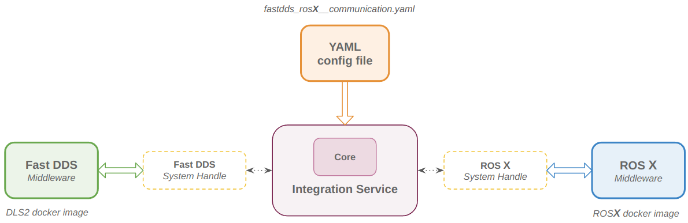
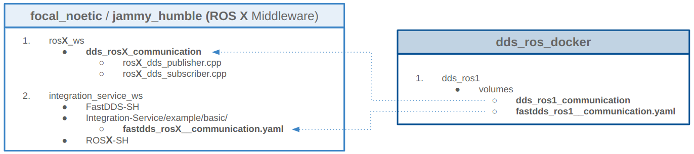
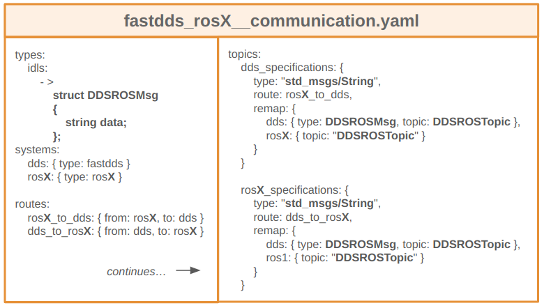

# DDS-ROS Docker

## DDS-ROS communication

This repository allows you to make Fast DDS and ROS **X** (1 or 2) communicate to each other.\
This communication is possible thanks to the [eProsima Integration Service](https://integration-service.docs.eprosima.com/en/latest/) bridge, a YAML configuration file and the Fast DDS and ROS **X** System Handles.

The Docker images used to test the communication among these protocols are:
* **DLS2**\
  Fast DDS protocol
* **Focal Noetic** / **Jammy Humble**\
  ROS 1 / 2 protocol, respectively.\
  These are built with the Dockerfiles of the *dds_ros1* / *dds_ros2* folders and the images are already available on *Server Harbor* (ip: 10.240.104.9).

The **Focal Noetic** Docker image contains:
* Ubuntu 20.04 LTS Focal Fossa
* ROS 1 Noetic Ninjemys
* Fast DDS
* Integration Service (with both Fast DDS and ROS 1 System Handles).

The **Jammy Humble** Docker image contains:
* Ubuntu 22.04 LTS Jammy Jellyfish
* ROS 2 Humble Hawksbill
* Fast DDS
* Integration Service (with both Fast DDS and ROS 2 System Handles).

The main components needed to allow this communication are:

**DLS2**
* *dds_ros_communication*\
  This folder od DLS2 contains a Fast DDS publisher and subscriber. These publish/listen a *DDSROSMsg* message through the *DDSROSTopic* topic.\
  The message structure in DLS2 is defined with the *dds_ros.idl* file.

**Focal Noetic / Jammy Humble**
* *dds_ros**X**_communication*\
  This folder is mounted in the Docker image and can be built to run a ROS **X** publisher and subscriber. These publish/listen a *DDSROSMsg* message through the *DDSROSTopic* topic.   

* *fastdds_ros**X**__communication.yaml*\
  This configuration file is mounted in the Docker image and is used by *Integration Service* to provide the conversion between the Fast DDS and ROS **X** protocols, using their System Handles.

## Pull the Docker images 

The Docker images are on *Server Harbor* and can be pulled with:

* `docker pull server-harbor:80/dls2/focal_noetic`
* `docker pull server-harbor:80/dls2/jammy_humble`

## Run the Docker images

You can run the Docker images with:

* `cd $HOME/dls_ws_home/dds_ros_docker` (check your path)
* `./run_image.sh <DOCKER_IMAGE_NAME> <FLAG_VOLUMES>`

where:
* **DOCKER_IMAGE_NAME**:
  * focal_noetic
  * jammy_humble
* **FLAG_VOLUMES** (optional):
  * -v\
  If used, the image is opened with the content of the *volumes* folder.\
  The folder mounts the *fastdds_ros**X**__communication.yaml* file in the *integration_service_ws* and the *dds_ros**X**_communication* folder in the *ros**X**_ws* (either *ros1* or *ros2*, according to the image launched).\
  If not specified, it runs the image without mounting any volumes.

## Attach the Docker images

You can execute a new shell session in the running container, with:

* `cd $HOME/dls_ws_home/dds_ros_docker` (check your path)
* `./attach_image.sh <DOCKER_IMAGE_NAME>`

where:
* **DOCKER_IMAGE_NAME**:
  * focal_noetic
  * jammy_humble

## Build the Docker images

If you want to build the Dockerfiles of this repository instead of using the Docker images on the server, you can do:

* `cd $HOME/dls_ws_home/dds_ros_docker` (check your path)
* `./build_image.sh <DOCKER_IMAGE_NAME> <FLAG_NO_CACHE>`

where:
* **DOCKER_IMAGE_NAME**:
  * focal_noetic
  * jammy_humble
* **FLAG_NO_CACHE** (optional):
  * -nc\
  If used, the image is built without considering the cache. If not specified, it automatically builds the image considering the cache.

The image will be built and tagged as ``server-harbor:80/dls2/<DOCKER_IMAGE_NAME>:latest``.

## Push the Docker images

To push a Docker image on *Server Harbor*, you can run:

* `cd $HOME/dls_ws_home/dds_ros_docker` (check your path)
* `./push_image.sh <DOCKER_IMAGE_NAME>`

where:
* **DOCKER_IMAGE_NAME**:
  * focal_noetic
  * jammy_humble

You will be asked to confirm by pressing `[y/n]` before pushing the image online.

**IMPORTANT:** This step is not required and you should push a new image only if really needed. This will automatically overwrite the image online.

## Test DDS - ROS1 communication

To test the communication among DDS and ROS1 using the *Integration Service* bridge, you can open a Terminator window, split in four different terminals.

### DLS2 image

In the first terminal, you can run:

* `dls2`
* `cd dls2_deploy/build`
* `ccmake ..`\
  Select the packages that you want to compile, press `c` twice and then `g`
* `make && sudo make install`
* `cd ../dls2/bin/Release`
* `./dds_ros_communication -m <EXECUTABLE>`

where:
* **EXECUTABLE**:
  * publisher
  * subscriber

### Focal Noetic image

In the second terminal, you can run:

* `./run_image.sh focal_noetic -v`
* `roscore`

In the third terminal, run:
* `./attach_image.sh focal_noetic`
* `cd ros1_ws`
* `catkin_make`
* `source devel/setup.bash`
* `rosrun run dds_ros2_communication <EXECUTABLE>`

where:
* **EXECUTABLE**:
  * ros1_dds_publisher
  * ros1_dds_subscriber

Now you have a publisher and a subscriber running, but these can not communicate yet. You miss a last step, that is running the *Integration Service* bridge.

In the fourth terminal, run:

* `./attach_image.sh focal_noetic`
* `integration-service integration_service_ws/src/Integration-Service/examples/basic/fastdds_ros1__communication.yaml`

You will see now the publisher and subscriber communicating to each other.

Obviously, if you have run the *publisher / subscriber* in DLS2, you have to run the *ros1_dds_subscriber / ros1_dds_publisher* in *Focal Noetic* and viceversa to test the communication in both the directions.

## Test DDS - ROS2 communication

To test the communication among DDS and ROS2 using the *Integration Service* bridge, you can open a Terminator window, split in three different terminals.

### DLS2 image

In the first terminal, you can run:

* `dls2`
* `cd dls2_deploy/build`
* `ccmake ..`\
  Select the packages that you want to compile, press `c` twice and then `g`
* `make && sudo make install`
* `cd ../dls2/bin/Release`
* `./dds_ros_communication -m <EXECUTABLE>`

where:
* **EXECUTABLE**:
  * publisher
  * subscriber

### Jummy Humble image

In the second terminal, you can run:

* `./run_image.sh jammy_humble -v`
* `cd ros2_ws`
* `colcon build`
* `source install/setup.bash`
* `ros2 run dds_ros2_communication <EXECUTABLE>`

where:
* **EXECUTABLE**:
  * ros2_dds_publisher
  * ros2_dds_subscriber

Now you have a publisher and a subscriber running, but these can not communicate yet. You miss a last step, that is running the *Integration Service* bridge.

In the third terminal, run:

* `./attach_image.sh jammy_humble`
* `integration-service integration_service_ws/src/Integration-Service/examples/basic/fastdds_ros2__communication.yaml`

You will see now the publisher and subscriber communicating to each other.

Obviously, if you have run the *publisher / subscriber* in DLS2, you have to run the *ros2_dds_subscriber / ros2_dds_publisher* in *Jammy Humble* and viceversa to test the communication in both the directions.